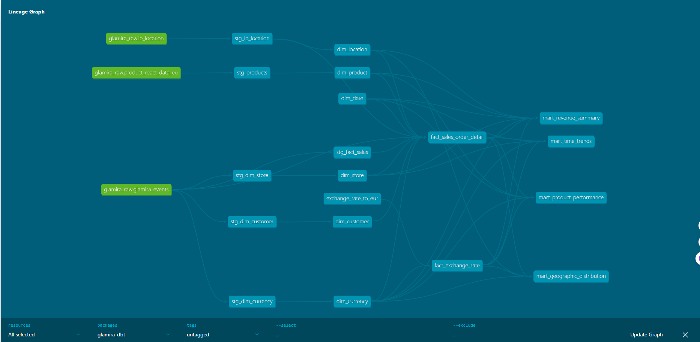

# Glamira dbt Project

Data transformation pipeline for Glamira e-commerce analytics using dbt + BigQuery, with PII protection and BI dashboards.

## Looker Studio Dashboard

[Sale Performance Dashboard (PDF)](docs/sale_performance_dashboard.pdf)

Dashboard includes:
- Total Revenue, Daily Avg Revenue, Total Quantity, Daily Avg Quantity (scorecards)
- Revenue Over Time, Number of Orders Over Time (time series)
- Top 5 Revenue By Stone, Top 5 Product By Revenue (bar charts)
- Revenue By Metal Type (pie chart)
- Revenue By Country (heatmap world map)
- Country + Date filters with cross-filtering

## Lineage Graph



## Architecture
glamira_raw (BigQuery)
↓ staging layer  (views)
↓ core layer     (tables: dims + facts)
↓ mart layer     (tables: aggregated for BI)
↓ Looker Studio Dashboards

## Infrastructure

| Component | Details |
|---|---|
| GCP Project | project-5-unigap |
| Region | asia-southeast1 (Singapore) |
| BigQuery Staging | glamira_dbt_staging |
| BigQuery Core | glamira_dbt_core |
| BigQuery Mart | glamira_dbt_mart |

## Project Structure

- **dbt_project.yml** — dbt project configuration
- **packages.yml** — external packages (dbt_utils, dbt_expectations)
- **seeds/**
  - `exchange_rate_to_eur.csv` — 35 currencies → EUR fixed rates
- **models/**
  - **staging/** — Views: clean & normalize raw data
  - **core/** — Tables: dims + facts
  - **mart/** — Tables: aggregated for BI
- **docs/**
  - `lineage_graph.png` — dbt DAG visualization
  - `sale_performance_dashboard.pdf` — Looker Studio dashboard export

## Data Models

### Staging (Views)
| Model | Source | Description |
|---|---|---|
| stg_dim_customer | glamira_events (ALL events except checkout) | Logged-in users with USER_ID_DB + email |
| stg_dim_store | glamira_events (checkout_success) | Store ID + checkout URLs |
| stg_dim_currency | glamira_events (checkout_success) | Currency symbols + names |
| stg_fact_sales | glamira_events (checkout_success) | Cart products unpivoted, price cleaned |
| stg_ip_location | ip_location | IP geolocation |
| stg_products | product_react_data_eu | Product catalog from EU store |

### Core — Dimensions
| Model | Description |
|---|---|
| dim_customer | Customer dimension with SCD Type 2. FARM_FINGERPRINT(user_id + email) |
| dim_product | Product dimension — name, type, category, price range |
| dim_date | Date dimension Apr 2020 - Mar 2021 |
| dim_location | Geographic dimension from IP geolocation |
| dim_store | Store dimension — 65 stores, 50+ countries |
| dim_currency | Currency dimension — 35 currencies |

### Core — Facts
| Model | Materialization | Description |
|---|---|---|
| fact_sales_order_detail | incremental (merge) | 1 row per product per order |
| fact_exchange_rate | table | Fixed exchange rates → EUR |

### Mart
| Model | Description |
|---|---|
| mart_revenue_summary | Revenue by date, product, location, currency |
| mart_geographic_distribution | Orders by country/region/city |
| mart_product_performance | Product metrics by type/category/metal/stone |
| mart_time_trends | Time-based order trends |

## Key Features

### CTE Naming Convention
Each model follows a structured CTE pattern:
- `__source` → read from source
- `__rename` → rename columns
- `__cast_type` → cast data types
- `__gen_key` → generate surrogate keys (FARM_FINGERPRINT)
- `__get_distinct` → deduplicate
- `__add_default_values` → add UNKNOWN row (-1)

### Surrogate Keys
All dims use `FARM_FINGERPRINT` for stable, deterministic keys.

### UNKNOWN Rows
All dims include a default `-1` UNKNOWN row for unmatched fact records.

### SCD Type 2 — dim_customer
Tracks customer email changes over time:
- `valid_from` TIMESTAMP — when record became active
- `valid_to` TIMESTAMP — when record expired (3000-01-01 = current)
- `is_current` STRING — 'Y' if currently active, 'N' if historical

### Exchange Rate
- Seed file with 35 currencies → EUR (Apr 2020 fixed rates)
- `fact_exchange_rate` stores rates keyed by `currency_key`
- Mart models JOIN `fact_exchange_rate` to compute `sales_amount_eur`

### Incremental Fact
`fact_sales_order_detail` uses incremental merge strategy:
```sql
config(
    materialized='incremental',
    incremental_strategy='merge',
    unique_key='sales_order_detail_key',
    on_schema_change='append_new_columns'
)
```

### PII Masking via BigQuery Policy Tags

Sensitive columns are protected using BigQuery Column-Level Data Masking with Policy Tags, providing role-based access control without modifying source data.

**Architecture:**
BigQuery Table (data stored as-is):
dim_customer.email         → john@gmail.com (stored raw)
fact_sales_order_detail.ip → 178.38.90.119 (stored raw)
Access control by IAM role:
Fine-Grained Reader (admin) → sees real data
Masked Reader (viewer)      → sees masked data
No role                     → access denied

**Setup:**
- Taxonomy: `Glamira PII Classification` (asia-southeast1)
- Policy Tags:
  - `email_pii` → applied to `dim_customer.email`
  - `ip_pii` → applied to `fact_sales_order_detail.ip`
- Data Policies:
  - `email_mask_policy` → Email Mask rule (`XXXXX@gmail.com`)
  - `ip_mask_policy` → Default Masking Value rule

**Example outputs:**

| Role | email | ip |
|---|---|---|
| Fine-Grained Reader | `john@gmail.com` | `178.38.90.119` |
| Masked Reader | `XXXXX@gmail.com` | (empty) |
| No role | Access Denied | Access Denied |

### Schema Contract
All core models enforce schema contracts:
```yaml
config:
  contract:
    enforced: true
```

### dbt_expectations Tests
- `expect_compound_columns_to_be_unique` — fact PK validation
- `expect_table_row_count_to_be_between` — row count bounds
- `expect_column_min_to_be_between` — price/quantity >= 0

## Data Quality

### Customer Coverage
- 31,126 unique logged-in users
- 91 users with multiple emails (tracked via SCD Type 2)

### Fact Match Rate
- 26,967 total sales rows
- 17,457 (64.73%) matched to logged-in customers
- 9,510 (35.27%) guest checkouts → customer_key = -1

### dbt Tests
- 43 data tests
- All 43 tests passing

## Packages

```yaml
packages:
  - package: metaplane/dbt_expectations
    version: 0.10.10
  - package: dbt-labs/dbt_utils
    version: 1.3.3
```

## Setup

```bash
# Activate environment
source ~/glamira-env/bin/activate

# Install packages
cd project07
dbt deps

# Configure
dbt debug

# Run
dbt seed                                        # load exchange rate
dbt run --full-refresh                          # full build all models
dbt run                                         # incremental run
dbt test                                        # run 43 tests
dbt docs generate                               # generate documentation
dbt docs serve --host 0.0.0.0 --port 8081       # serve docs
```

## Dashboards

Looker Studio dashboard built on top of `glamira_dbt_mart` tables:
- Revenue Analysis (scorecards + time series)
- Geographic Distribution (world heatmap)
- Time-based Trends
- Product Performance (top products, metal types, stones)

See [dashboard PDF](docs/sale_performance_dashboard.pdf) for preview.

## Author

Nguyen Minh Dat — May 2026
